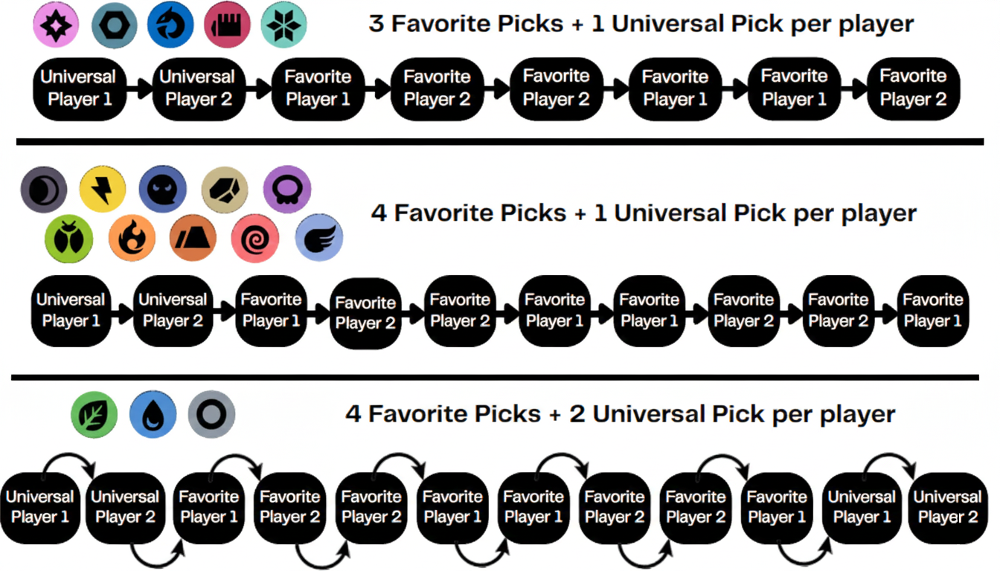

# Roguemon Rivals Tournament Series

Roguemon Rivals is a competitive format for the Roguemon Pokemon challenge where two players draft Pokemon across 3 types and battle for the title of Pokemon champion. The Winter Invitational is a single elimination tournament consisting of 16 players battling it out across 4 rounds of head-to-head matches. Each round consists of a drafting phase and a running phase which is detailed below. Players will be randomly placed into a bracket and the types of each round will be randomized. For more information on how to play in the tournament, please use the resources below or feel free to message in the Tournament Discord.

---

# Round Structure
### Drafting Phase
Each round players will draft favorites which they must run and universal picks which both players can run. This can be organized through voice chat or text chat in Discord. In the past Discord DMs have worked very successfully for the drafting phase. The overall process should take about 5 minutes but please note that we have a variety of time zones in this tournament. If you don’t get an immediate response, please give the other player time as they might be busy with work, general life things, and sleep. The player that is bracketed at the top will pick first on type 1 and 3 while the player that is bracketed at the bottom will pick first on type 2. Feel free to use this template to guide your drafting phase:
Once players have drafted all of their Pokemon, the Running phase begins. This means go play! This will proceed like normal A2 Roguemon with the exception of how you pivot (see below).

**Pokemon Rankings by Zoga: (Good for pivot data opinions may vary)**  
[👉 Click here to view the Pokemon Rankings](https://docs.google.com/spreadsheets/d/1tiS6qI93a8kvGv_6gLdTAVDttsU-ztQQgtx_xshBj_c/edit)

**Draft Tracker:**  
[👉 Click here to view the Draft Tracker](https://docs.google.com/spreadsheets/d/1G84KmMYkxTKnaFUwMx1JH2rcPc4vGFONExM2cCNFI4g/edit?usp=sharing)

---

### Pivoting Guidelines
Pivoting is dictated by what you drafted. Please note that there is no scouting. Your choices can only come from the lab and the abandoned balls outside the lab. The difficulty of Rivals is created by running your suboptimal favorites rather than choosing the best Pokemon in each seed. If you are lucky your favorite will be the best, but from experience with the format it is unlikely. With that in mind follow these rules:

### Lab Priorities:
1.	You must select a drafted pokemon (Universal or Your Favorite)
2.	If you don’t have a favorite, you must fight your opponent’s favorite
3.	If there are no favorites for either player, you have free choice.

### Abandoned Balls:
After beating the Lab Rival, you must pick up the 5 abandoned balls outside the lab. These 6 pokemon are your potential pivots. Here are a few cases:
#### Case 1:
You only have 1 favorite/universal pick available  You must run that pokemon
#### Case 2:
You have multiple favorites/universal picks available  You may choose your pokemon from the available favorite/universal picks.
#### Case 3:
There are 0 favorites/universal picks available  You can pick any pokemon you want that is not an opponent’s favorite Pokemon.

Once you have selected your pivot you are ready to start running! Normal A2 Roguemon rules apply so please refer to Roguemon.gg for rules clarification or the Roguemon Discord.

---

<strong>📁 Resources</strong>

- 📝 [Draft Template Sheet](https://docs.google.com/spreadsheets/d/1G84KmMYkxTKnaFUwMx1JH2rcPc4vGFONExM2cCNFI4g/edit?usp=sharing)
- 📈 [Scoreboard Template (Make a Copy)](https://docs.google.com/spreadsheets/d/1AbWa4WPAQiyzlvI2I5l_m0M3YqE-ZPL32wDu0jRsoHI/edit?gid=0#gid=0)

---
## Frequently Asked Questions

<strong> Do my opponent and I have to complete the types in the same order? </strong>

Absolutely not! You may play any of the three types selected for a round within the 2-week period. It is actually advised to mix and match based on your opponent’s personal best (PB). The goal is achieving the farthest run, not necessarily win it the seed. If you are ahead of your opponent, maybe hold off on the other seeds just in case they surpass you.
  

<strong> How do we decide who drafts first? </strong>

The player on top of the bracket will draft first and you will draft the typings from left to right. In other words, the top player will draft first on types 1 and 3 while the bottom player will draft first on type 2.
 

<strong> How should we approach a run that ends at Cycling Road? </strong>

Cycling Road can be …. troublesome. We understand that you can technically skip Cycling Road due to the lack of mandatory trainers. To ensure a positive competitive environment, we ask that you at least attempt Cycling Road if your opponent has a PB during this segment. If you need to end early that is fine, but a complete skip is frowned upon.
 

<strong> What happens if all lab mons are unselectable? </strong>

Unfortunately, that is a seed reset.
 

<strong> What happens if you only have 1 favorite but it has Pure/Huge Power? </strong>

Don't reset the seed! Play as if no favorites are available and chose any Pokemon that was not drafted by either player.
 

<strong> How do I report the score? </strong>

Post the scores and a link to the VOD in the Discord thread for each round. Make sure that you and your opponent have open communication so you understand the standings at any point in the round!
 

<strong> What patch is the Winter Invitational played on? </strong>

Most recent beta patch (Version: 1.5.1-beta.3)
 

<strong> If I get a non-favorite shiny, can I run that instead of a favorite? </strong>

Sure! The original ruleset of Roguemon does have a Shiny clause which we will permit. IIRC the original ruleset for Roguemon allows you to level it to 8 so the shiny has a chance.
 

<strong> How do the penalties for Shell Bell, draining moves, and offensive setup factor into my score? </strong>

These penalties are only factored into winning runs (which is a low chance in A2) and will be utilized for tie breakers if both players win a seed.
 

<strong> Do I need to stream every seed attempt? </strong>

Yes! In order to verify each run and guarantee a fair competitive environment the runs must be watchable. Please make sure that your VODs are available through your preferred streaming service.
 

<strong> Is Discord a permissible alternative to streaming? </strong>

Unfortunately, it is not since the VODs would not be viewable after you ended the run.
 

<strong> What should I do if a rule is broken? </strong>

This is a friendly tournament, so hopefully cheating won’t be a thing but mistakes do happen. Feel free to DM Porofessor or ZogaOak on Discord.
 

<strong> Is time machining allowed for simple mistakes? </strong>

To avoid an exhaustive list of yes and no’s, all use of time machine will be banned.
 

<strong> Do I still get to play if I lose the first round? </strong>

Yes! There will be an optional lower bracket where all round 1 eliminated players can participate in an alphabet draft. It is entirely optionally but should be fairly fun to battle it out against 7 other players.
 

 
---

## Credits
Tournament Series Created by: ThePorofessor and ZogaOak

Roguemon Rivals Format Created by: [iCrucialx](https://twitch.tv/icrucialx) and [Ceedsy](https://twitch.tv/ceedsy) 

Inspired by: [Roguemon by Crozwords](https://github.com/Crozwords/Roguemon)

<i>Roguemon Rivals is a fan-made competition format and not affiliated with Nintendo, Game Freak, or The Pokémon Company.</i>

